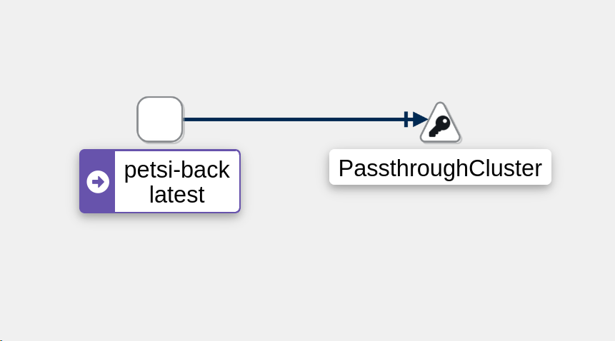

kubectl patch service petsi-back -p '{"spec":{"selector":{"color":"green"}}}'

kubectl apply -f https://raw.githubusercontent.com/istio/istio/release-1.16/samples/addons/kiali.yaml

kubectl apply -f https://raw.githubusercontent.com/istio/istio/release-1.16/samples/addons/prometheus.yaml

kubectl label namespace default istio-injection=enabled --overwrite

kubectl scale deploy/petsi-petsi-back-v2

Pros:
• version released for a subset of users
• convenient for error rate and performance monitoring
• fast rollback

Cons:
• slow rollout
• sticky sessions might be required
• precise traffic shifting would require additional tool like Istio or Linkerd