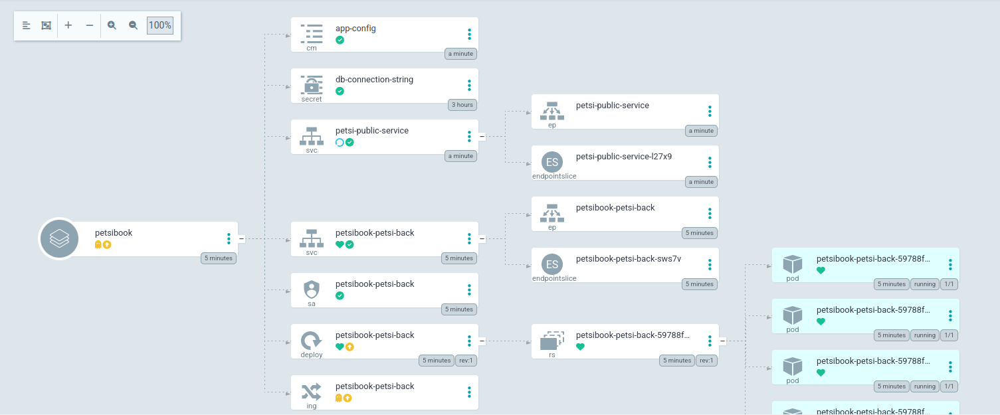

# Petsi DevOps
## Execution
First Clone the repository:

```sh
git clone https://github.com/souheilbenslama/Gl5DevOps.git
git checkout dev
```

Apply the provision stack:
```sh
cd automation/provisionning-stack
terraform init
terraform apply
```

Apply the setup stack:
```sh
cd automation/setup-stack
terraform init
terraform apply
```

Install the helm of the application:
```sh
cd Deployment
helm install petsi petsi-back
```

Apply the argoCD application.yaml to make argoCD engine watch the helm chart repository:
```sh
cd DevOps
kubectl apply -f application.yaml
```

Url for the backend: http://petsi.francecentral.cloudapp.azure.com:4000

Endpoints: 
 - GET: /getUsers 
 - GET: /getVets
 - POST: /petsForSale
 - POST: /petsForAdoption


Deployed Architecture:
